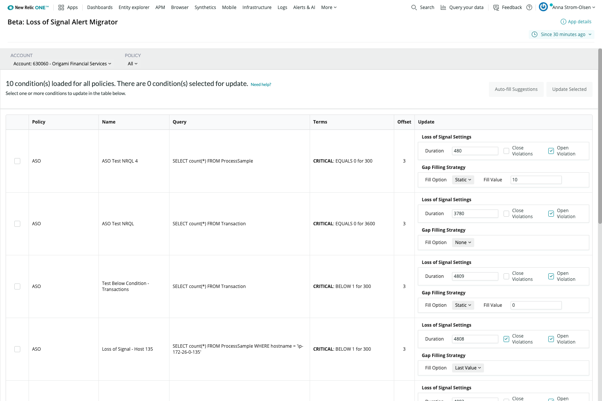

## Overview
Throughout the month of October, 2020, New Relic is rolling out “New Relic One Streaming Alerts” for NRQL Conditions. This new platform will deliver a good number of benefits that will ultimately make alerts more accurate and reliable while delivering significant improvements in time-to-detect.  [Read about the details of this release here.](https://discuss.newrelic.com/t/announcing-new-relic-one-streaming-alerts-for-nrql-conditions/115361)

With this rollout, we will be making the entire streaming pipeline event-driven to improve reliability,  delivering official support for loss of signal detection, and allowing you to specify which gap filling strategy you wish to use.  

### Critical Change in Behavior
This rollout will change behavior that you may be relying on to detect when an entity or service goes offline.  We will no longer be inserting a “0” into the alert evaluation stream when there are gaps in the data.  Gaps in data occur when there is no data for a specific aggregation window.  Therefore, if you are currently monitoring for the uptime of an entity of service using an alert condition with an evaluation that uses a “<” operator, or  “=0” , they will immediately stop working once the new streaming platform is enabled on your account.  This will result in “false negatives” if that monitored service does go down.

__To prevent this__, you MUST update all such NRQL conditions to use the new loss of signal detection capability BEFORE, or immediately after, New Relic One Streaming Alerts is enabled for your account.  If you are reading this after October 28, 2020, then you can use this to find the conditions that may no longer be working and need updating.

## Usage

This app is a bulk review and editing tool for all nrql conditions for a given account that use either the “<” operator with any threshold value, or use the “=” operator with a threshold value of “0”.   The key elements of the NRQL Condition are listed as read-only in the left portion of a row, with the new settings for Loss of Signal and Gap Filling exposed on the right side. If there are already values set for those fields, they will be displayed.   You may edit and update conditions individually, or edit and update them in batches. 

The __“Auto-fill Suggestions”__ button is here to help you if you are not sure what to enter for Loss of Signal duration.  When you select a set of NRQL condition rows, and click the button, it will fill in a time for the duration and enable the “open violation on expiration” option.  The duration time will be the sum of the evaluation duration and the evaluation offset.  

## What do the Settings Mean
### Loss of Signal
__Duration:__  Also listed as “expiration.duration” in NerdGraph, is the clock-time for how long we should wait from the time the alert service received the last data point before we consider this signal lost. 

__Open Violation:__ When a signal is considered lost, you have the option to open a new violation, which will usually create a new notification.  “Auto-fill Suggestions” will check this box.

__Close Violations:__ When a signal is considered lost, you can choose to close all open violations related to that signal. This is useful for ephemeral services, or if the signal stopping causes a violation to not close.  When both options are chosen, all violations for that signal are closed before the new “Loss of Signal” violation 

### Gap Filling Strategy 
__Fill Option:__  There are 3 fill option strategies to choose from : None, Static, and Last Value.  
- “None” is the default. When there is an aggregation window that has no value when being evaluated, the window will stay empty, and the evaluation duration timer will reset. 
- “Last value” will carry the last seen value forward to fill that gap before being evaluated.
- “Static” will fill the gap with a static value that you specify in the “Fill Value” field.  For most use cases, the value used here is “0”. The “Fill Value” field is only valid for the “static” fill option.

## Open Source License

This project is distributed under the [Apache 2 license](https://github.com/newrelic/nr1-alerts-los-migrator/blob/main/LICENSE).

## What do you need to make this work?

1. [New Relic One](https://newrelic.com/platform)

## Community Support

New Relic hosts and moderates an online forum where you can interact with New Relic employees as well as other customers to get help and share best practices. Like all New Relic open source community projects, there's a related topic in the New Relic Explorers Hub. You can find this project's topic/threads here:

[https://discuss.newrelic.com/t/loss-of-signal-alerts-migrator/116684](https://discuss.newrelic.com/t/loss-of-signal-alerts-migrator/116684)

Please do not report issues with Loss of Signal Migrator to New Relic Global Technical Support. Instead, visit the [`Explorers Hub`](https://discuss.newrelic.com/t/loss-of-signal-alerts-migrator/116684) for troubleshooting and best-practices.

## Issues / Enhancement Requests

Issues and enhancement requests can be submitted in the [Issues tab of this repository](https://github.com/newrelic/nr1-alerts-los-migrator/issues). Please search for and review the existing open issues before submitting a new issue.

## Contributing

Contributions are welcome (and if you submit a Enhancement Request, expect to be invited to contribute it yourself :grin:). Please review our [Contributors Guide](https://github.com/newrelic/nr1-alerts-los-migrator/blob/main/CONTRIBUTING.md).

Keep in mind that when you submit your pull request, you'll need to sign the CLA via the click-through using CLA-Assistant. If you'd like to execute our corporate CLA, or if you have any questions, please drop us an email at opensource@newrelic.com.